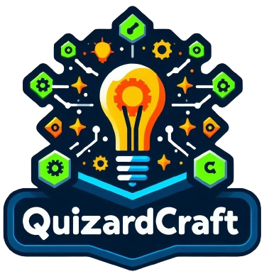

# QuizardCraft
<div align="center"> 
  
</div>

## Overview
Welcome to QuizardCraft, a powerful tool designed to enhance the learning experience, enabling users to effortlessly generate personalized flashcards based on the provided topics, aiding in information retention, knowledge testing, and exploration of new subjects.

## Features
- **Adaptive Learning:** QuizardCraft adapts to your learning needs, providing a dynamic and personalized study experience.
- **Topic Customization:** Input any topic of your choice, and QuizardCraft will create flashcards that cover key concepts, facts, and questions related to that subject.
- **User-Friendly Interface:** The intuitive interface makes it easy for learners and educators to navigate, ensuring a seamless experience.
- **Knowledge Testing:** Assess your understanding of a topic by using the generated flashcards for self-assessment or quizzes.

## Demonstration

https://github.com/suravshrestha/QuizardCraft/assets/24486999/e486fb7b-8ec5-4b4a-b788-33c5a08237e2

## Getting Started

### Prerequisites
- [Node.js](https://nodejs.org/en/)
- OpenAI API key

### Installation

1. Clone the repository:

```
git clone https://github.com/suravshrestha/quizardcraft.git
```

2. Navigate to the repository 📂:

```
cd quizardcraft
```

3. Install the dependencies

```
npm install
```

4. Create a `.env` file inside the root directory

```
touch .env
```

5. Set the following credentials inside the `.env` file

```
#.env
VITE_OPENAI_API_KEY=
```

### Usage

Run the development server:
```
npm run dev
```
   
## Contributing

We welcome contributions to QuizardCraft! If you find bugs or have ideas for new features, please open an issue or submit a pull request.

## License

This project is licensed under the MIT License - see the [LICENSE](LICENSE) file for details.

Happy learning with QuizardCraft! 📚 ✨
